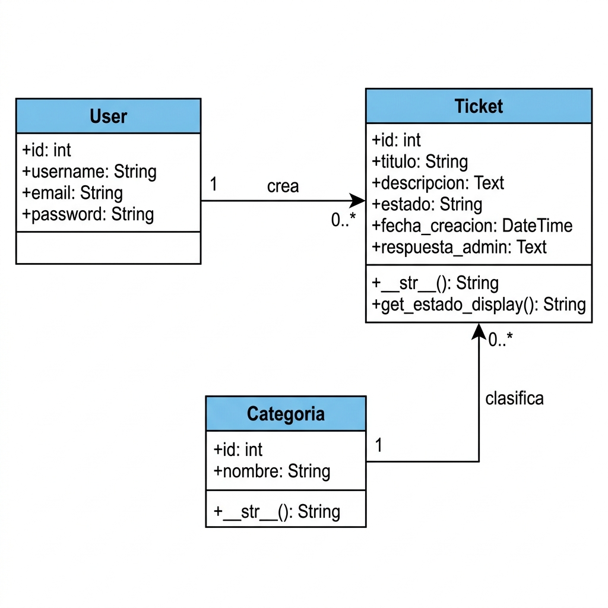
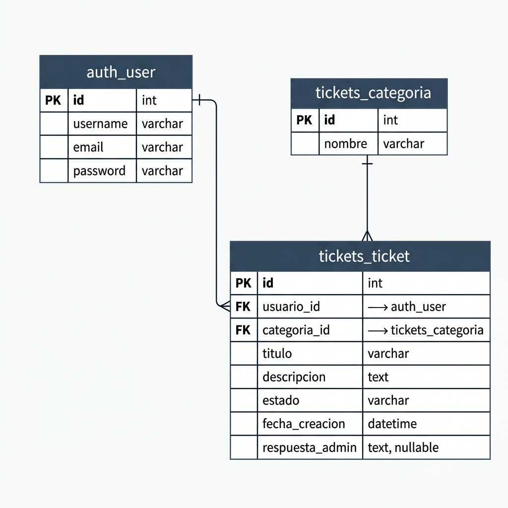

# Diseño del Sistema de Tickets

## Sobre mí
**Nombre:** Andres Felipe Charry Camacho
**Perfil:** Estudiante de último año de Ingeniería de Sistemas y Computación. Cuento con experiencia en el desarrollo de servicios backend y validación de datos clínicos en el  Programa Madre Canguro y consultoría técnica funcional en Avisini Software. Tengo un fuerte enfoque en el uso de Python y SQL para construir sistemas escalables y optimizados. 

---

## Decisiones Técnicas
Elegí **Django** porque es súper rápido para montar este tipo de sistemas. Usé la arquitectura que trae por defecto (MVT) y manejé todo con **plantillas HTML y Bootstrap**, así el código es fácil de leer y no se necesita un front separado.

### Enfoque en UX/UI
Aunque el sistema es sencillo, se puso especial cuidado en la interfaz para que fuera profesional y moderna:
*   **Tipografía:** Uso de 'Inter' vía Google Fonts para una lectura más clara y estética.
*   **Iconografía:** Integración de FontAwesome para dar contexto visual a las acciones y botones.
*   **Diseño Limpio:** Uso de sombras suaves, bordes redondeados y una paleta de colores coherente para una experiencia de usuario superior.

### Categorías de los Tickets
Propuse estas tres para empezar:
*   **Soporte Técnico:** Para fallos del sistema.
*   **Facturación:** Dudas con pagos.
*   **Sugerencia:** Ideas de los usuarios.
Elegí estas porque son las que cualquier empresa necesita de entrada y separan bien los temas.

---

## Modelos de Datos
El sistema se basa en tres tablas principales:
1.  **User:** El sistema de usuarios que ya trae Django.
2.  **Categoria:** Para clasificar los problemas.
3.  **Ticket:** Donde guardamos el título, descripción, el estado y la respuesta del admin.

### Diagrama de Clases

### Diagrama Entidad-Relación

---

## Notas y Asunciones
*   Decidí usar **SQLite** para que puedan probar el proyecto de una sin configurar servidores de base de datos pesados.
*   Por seguridad, el estado del ticket solo se puede cambiar desde el Panel de Admin de Django.
*   Los usuarios solo ven sus propios tickets, puse filtros en las vistas para asegurar esto.
*   **Seguridad de Contraseñas:** Se implementó un sistema de registro que utiliza el hashing de contraseñas nativo de Django (algoritmo PBKDF2 con SHA256), garantizando que las contraseñas nunca se guarden en texto plano.

---

## Uso de IA
Para este proyecto usé **Antigravity (un asistente de IA)**. Me ayudó principalmente a generar la estructura base de los archivos, y  redactar la documentación técnica para ir más rápido.
